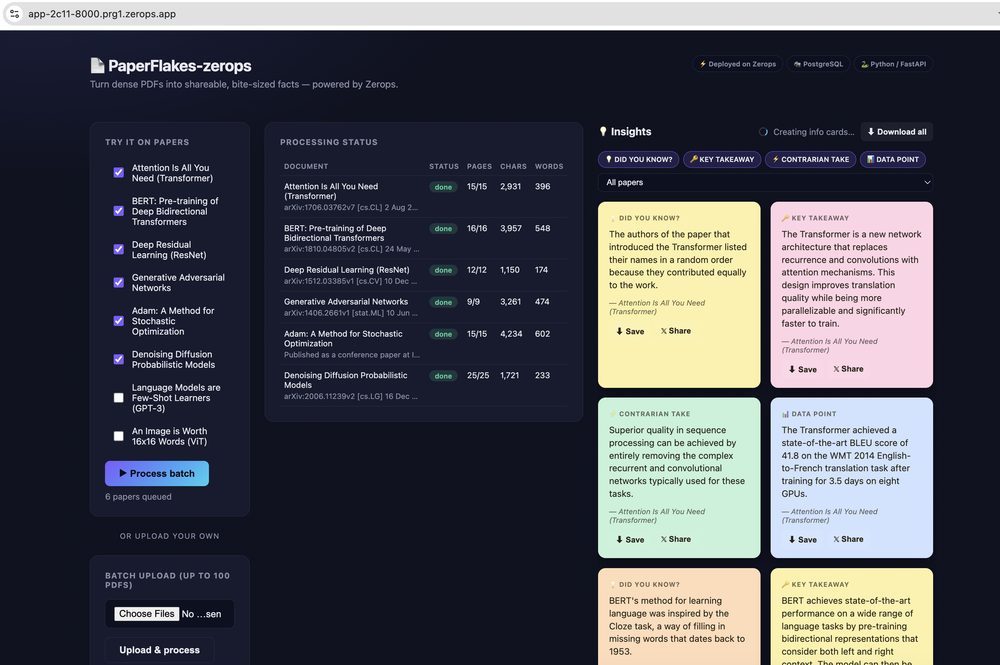
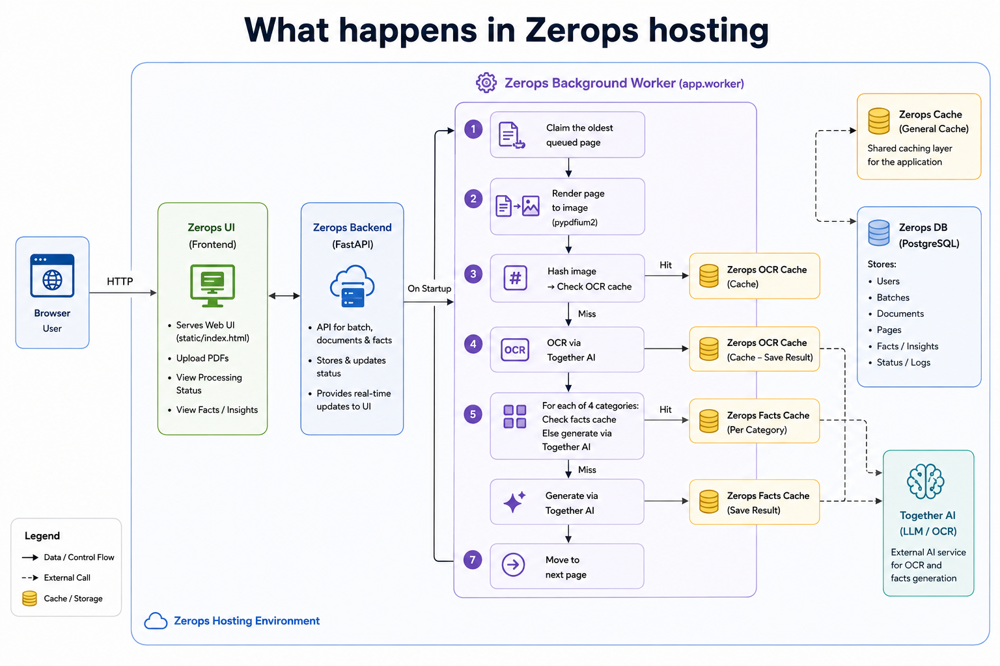
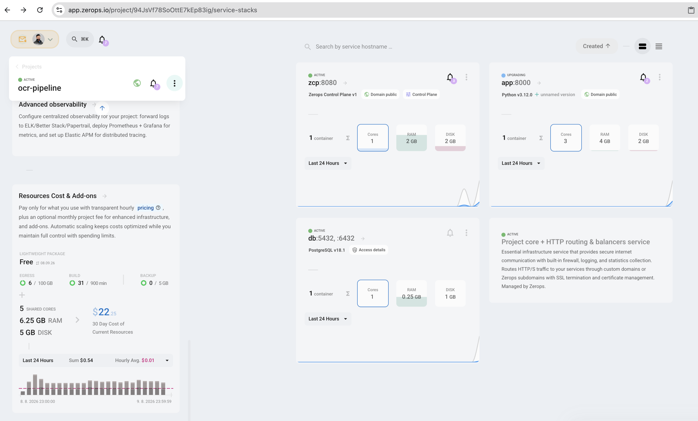

# PaperFlakes-Zerops

PaperFlakes transforms research PDFs into concise, shareable insight cards. Built and deployed on Zerops, it uses a Python/FastAPI service with a background worker and managed PostgreSQL to OCR and process PDFs asynchronously, distilling them into four categories of AI-generated insights. Insight cards can be filtered, downloaded, or shared on X.

- **Live app:** https://app-2c11-8000.prg1.zerops.app/
- **Blog post:** https://dev.to/akash_goyal/why-i-built-paperflakes-and-how-zerops-saved-the-stack-2ki7
- **GitHub repo:** https://github.com/akashgoyal/paperflakes-zerops

## Built on Zerops

This whole project is heavily reliant on Zerops infra & built using the ZCP.

1. **Runtime service** — Python/FastAPI, running the web server and background worker.
2. **Managed PostgreSQL** — the only persistent store.
3. **Public HTTPS** — `zerops.app` subdomain, live automatically after deployment.
4. **Secrets** — `TOGETHER_API_KEY` stored as a Zerops service secret.
5. **Health checks** — readiness/health checks gate traffic on live DB connectivity.
6. **Git-based deployment** — pushes to `main` deploy the latest commit via `zcli`.
7. **ZCP with Claude Code** — infra provisioned and configured through the Zerops Claude Code plugin.

## How to use it

1. Open the [live app](https://app-2c11-8000.prg1.zerops.app/).
2. Check one or more papers under **"Try it on papers"** and click **Process batch**.
3. Watch the **Processing status** table update as each document is OCR'd.
4. Insight cards appear in the **Insights** panel as soon as each category finishes — no need to wait for the whole batch.
5. Use the category chips and paper dropdown above the panel to filter what's shown.
6. On any card: **Save** downloads it as a PNG.
7. On any card: **𝕏 Share** opens a pre-filled tweet.
8. **Download all** (top right) exports every currently-visible card as one combined image.

## Tech stack

Python, FastAPI, PostgreSQL, Together AI (OCR + insight generation), vanilla JS frontend — all hosted on Zerops.

For architecture details, design decisions, and the full backstory, see the [blog post](https://dev.to/akash_goyal/why-i-built-paperflakes-and-how-zerops-saved-the-stack-2ki7).

## Zerops Service Cost View

## Data model

| Table | Purpose |
|---|---|
| `batches` | one row per "process these documents together" action |
| `documents` | one row per PDF (uploaded or fetched from arXiv) |
| `pages` | one row per page — OCR status, extracted text, content hash |
| `facts` | one row per generated insight card, tagged with category + source page |
| `page_facts` | cache: `(content_hash, category) → fact text`, reused across any page with identical rendered content |

## API reference

| Endpoint | Purpose |
|---|---|
| `GET /` | the UI |
| `GET /status` | health check (DB connectivity) |
| `POST /api/batches` | create a batch |
| `POST /api/batches/{id}/documents` | upload a PDF into a batch |
| `POST /api/batches/{id}/documents-from-url` | fetch a PDF from arxiv.org into a batch |
| `GET /api/batches/{id}` | batch status: documents + generated facts |
| `GET /api/documents/{id}` | a single document's status + per-page detail |
